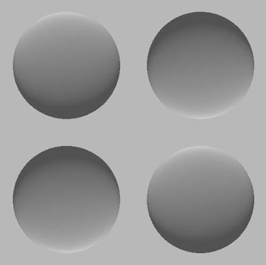

## Background

When we see a shaded disk, whether it looks like a **bump** (convex) or a **dent** (concave) depends on where we assume the light is coming from. The same physical shading pattern can look like a bump lit from one direction, or a dent lit from the opposite direction — the visual system has to make an assumption somewhere, and it turns out that assumption is a personal, measurable bias: your own **preferred lighting direction**.

In an experiment, a single participant views a shaded disk at many different orientations and judges, on each trial, whether it looks like a bump or a dent.



**Figure** from Adams, Graf, and Ernst (2004)

**Orientation convention:** `theta = 0` means the disk's shading is consistent with light coming from directly above. Negative values of `theta` mean the implied light source is rotated toward the participant's **left**; positive values mean it's rotated toward the participant's **right**.

Plotting the proportion of "bump" judgments against orientation traces out a curve that peaks at the participant's own preferred lighting direction. Far enough from that peak, on either side, the shading becomes genuinely ambiguous — light coming from directly the side gives almost no reliable information about whether the disk is a bump or a dent, so performance drops toward chance (50%), not down to 0%.

Your job: fit this model to one real participant's actual data, estimate their preferred lighting direction, and then think carefully about a real limitation of the fitting method you'll use first.

## The data

This is real data from a single participant, collected using an adaptive staircase procedure — the computer adjusted which orientation to test next based on the participant's previous responses, rather than testing every orientation a fixed number of times. **That's exactly why the trial counts below are so uneven**, and why some orientations have only 1-3 trials: the procedure spent its effort where it was most needed, not evenly everywhere. Notice also there's a real gap between 40° and 90° — this participant's staircases simply didn't explore that region much.

```{r}
theta <- c(-120, -110, -100, -90, -80, -70, -60, -30, -20, -10, 0, 10, 20, 30, 40, 90, 100, 110, 120)
n_trials <- c(20, 22, 15, 6, 2, 2, 1, 1, 3, 3, 7, 14, 17, 3, 1, 3, 6, 9, 11)
n_bump <- c(9, 12, 11, 5, 1, 1, 1, 1, 3, 2, 7, 13, 17, 3, 1, 3, 4, 6, 6)
prop_bump <- n_bump / n_trials

data <- data.frame(theta, n_trials, n_bump, prop_bump)
data
```

Look closely at the range of `n_trials`: from **1** all the way up to **22**. Keep this firmly in mind for Part 2.

## Part 1: Explore and fit

**Question 1.** Plot `prop_bump` against `theta`. **Hint:** since trial counts vary so drastically across orientations, it's worth showing that visually too — try scaling each point's size by its own `n_trials` (in base R, the `cex` argument to `points()`/`plot()` controls point size; something like `cex = sqrt(data$n_trials)` gives a reasonable range without the largest points overwhelming the plot). Describe the shape in your own words — where does the peak look like it is, roughly? Does this real participant's data look like a clean, symmetric bump, or messier than that?

**Question 2.** The model relating orientation to the probability of a "bump" response is:

$$p(\theta; \alpha, \tau, \sigma) = \Phi(\theta; \alpha - \tau/2, \sigma) - \Phi(\theta; \alpha + \tau/2, \sigma)$$

where $\Phi(x; \mu, \sigma)$ is the normal cumulative distribution function (`pnorm()` in R) evaluated at $x$, with mean $\mu$ and standard deviation $\sigma$. The three parameters mean:

- $\alpha$ — the orientation where the curve peaks. This is the number we actually care about: the participant's estimated preferred lighting direction.
- $\tau$ — the width of the peak (how wide a range of orientations look bump-like).
- $\sigma$ — how sharply the curve rises and falls at its edges.

Here's that formula written directly as an R function:

```{r}
bump_model <- function(theta, alpha, tau, sigma) {
  pnorm(theta, alpha - tau/2, sigma) - pnorm(theta, alpha + tau/2, sigma)
}
```

Test it with a couple of parameter combinations of your own choosing (e.g. `bump_model(theta = 10, alpha = 10, tau = 150, sigma = 40)`) — confirm the output is highest when `theta` equals `alpha`, and drops off as `theta` moves away from `alpha` in either direction. This is the function you'll be fitting to the real data for the rest of the assignment.

**Question 3.** Write `rmsd(params, data)`, following the same pattern as your Supervised Learning practical — it should compare `bump_model()`'s predictions against `data$prop_bump`.

**Question 4.** Fit the model with `optim()`. A reasonable starting point is `alpha = 0, tau = 150, sigma = 40`. Report the fitted `alpha` — this is your estimate of this participant's preferred lighting direction. Try re-running from one or two other starting points — does it converge to the same answer each time?

**Question 5.** Plot the fitted curve over the data (same point-size hint as Question 1). Does the fitted curve pass close to the two largest, most-trusted points (the ones with the most trials), or does it seem to be pulled more by the smaller, noisier ones?

## Part 2: Does every data point deserve equal say?

**Question 6.** Look back at `n_trials`. Several orientations have just 1-3 trials, while others have 15-22. The `rmsd()` function you wrote in Question 3 treats every orientation's error identically, regardless of how many trials it's based on. Explain, in your own words, why that might not be the right thing to do — think about how trustworthy a single trial's result (necessarily either 0% or 100%) is compared to a result built from 20+ trials.

**Question 7.** Write a second function, `rmsd_weighted(params, data)`, that weights each orientation's squared error by its own `n_trials`, instead of treating every orientation equally:

$$\text{weighted RMSD} = \sqrt{\frac{\sum_i n_i \,(\text{observed}_i - \text{predicted}_i)^2}{\sum_i n_i}}$$

Refit the model using `rmsd_weighted()` instead of `rmsd()`, starting from the same point as Question 4. Report the new fitted `alpha`, `tau`, and `sigma`. Then plot **both** fitted curves together on the same plot as the data (e.g. one in `"darkgreen"`, one in `"blue"`, with a legend) so you can compare them directly.

**Question 8 (discussion).** How different are the two fitted `alpha` values? Compute **both** `rmsd()` and `rmsd_weighted()` for **both** sets of fitted parameters — four numbers in total. You should notice a pattern: each fit scores *best* under the criterion it was actually optimized for, and worse under the other one. Explain why this happens — is it a coincidence, or is it guaranteed to be true by how `optim()` works? Then answer the actual question this is all in service of: given that the two fits disagree — possibly by quite a lot — which one would you actually report as your answer, and why? Refer back to your Question 6 reasoning.

**References**

Adams, W. J., Graf, E. W., & Ernst, M. O. (2004). Experience can change the'light-from-above'prior. Nature neuroscience, 7(10), 1057-1058.
