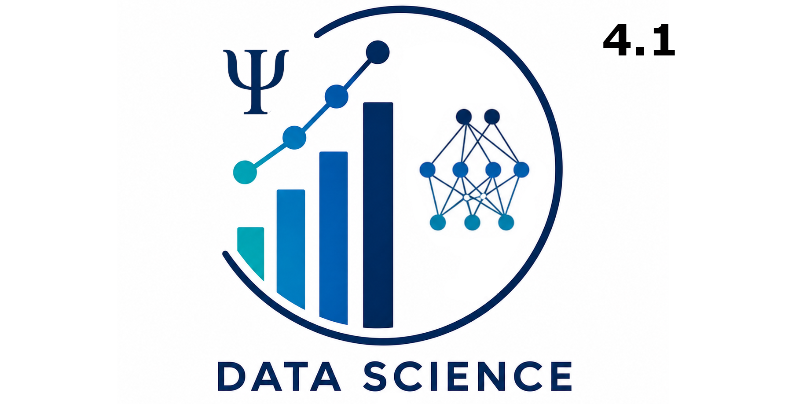

::: {.columns}
::: {.column style='width: 60%; text-align: left;' }
This online course manual that contains all instructions and the important study materials for the course "Data Science". Further information about this course are found on [Canvas](https://canvas.eur.nl/courses//55946).
:::
::: {.column style='width: 40%;'}

:::
:::


## Schedule

```{r}
#| echo: false

# linked materials
visible_practicals = 2
visible_solutions = 0
visible_lectures = 1

practical_title = c(
  "Introduction 1: R basics",
  "Introduction 2: R basics",
  "Parameter Estimation",
  "Neural Networks 1",
  "Neural Networks 2",
  "Cognitive Modelling",
  "Multinomial Processing Tree Models",
  "Reaction Time Models")

lecture_title= c(
  "Introduction to Data Science",
  "Parameter Estimation",
  "Neural Networks 1",
  "Neural Networks 2",
  "Cognitive Modelling",
  "Multinomial Processing Tree Models",
  "Reaction Time Models",
  "Q & A Lecture")

# practical rooms
practical_room = c(
  "2.02", #1
  "2.02", #8
  "4.02", #15
  "4.02", #22
  "1.12", #29
  "3.14", #6
  "2.20", #13
  "2.02" #20
)

## week links
week <- function(x) {
  w = as.Date('1.9.2026',format='%d.%m.%Y') + 7*(x-1)
  txt = format(w, format = "%d/%m")
  return(txt)
}

practical <- function(week) {
  if (week <= visible_practicals) {
    return(paste0("[", practical_title[week], "](practicals/data_science_week", week, ".Rmd)"))
  } else {
    return(practical_title[week])
  }
}

room <- function(week) {
  return(practical_room[week])
}

lecture <- function(week) {
  if (week <= visible_lectures) {
    return(paste0("[", lecture_title[week], "](slides/ds_lecture", week, ".pdf)"))
  } else {
    return(lecture_title[week])
  }
}
```

*Note: In the first week, the lecture is at 11:00 and a practical at 13:00.*


| Date        | Topic | Room        | Practical   (11:00) | Lecture (13:00)         |
| ----------- | :---: | ----------- | ------------------- | ----------------------- |
| `r week(1)` |   1   | `r room(1)` | `r practical(1)`    | `r lecture(1)`  (OL,YM) |
| `r week(2)` |   2   | `r room(2)` | `r practical(2)`    | `r lecture(2)`  (YM)    |
| `r week(3)` |   3   | `r room(3)` | `r practical(3)`    | `r lecture(3)`  (YM)    |
| `r week(4)` |   4   | `r room(4)` | `r practical(4)`    | `r lecture(4)`  (YM)    |
| `r week(5)` |   5   | `r room(5)` | `r practical(5)`    | `r lecture(5)`  (OL)    |
| `r week(6)` |   6   | `r room(6)` | `r practical(6)`    | `r lecture(6)`  (OL)    |
| `r week(7)` |   7   | `r room(7)` | `r practical(7)`    | `r lecture(7)`  (OL)    |
| `r week(8)` |   8   | `r room(8)` | `r practical(8)`    | `r lecture(8)`  (YM,OL) |


All tutorials find place in the **Langeveld** build. Please look at your timetable for the lecture halls. The exam will take place in the week after the last lecture, please check your timetable for the exact date and location.


# Rmd files

You can download the R-Markdown (.Rmd) files with the exercises for the practical sessions. You can open these files in RStudio and make changes.

```{r}
#| output: asis
#| echo: false
for (i in 1:visible_practicals)
{
  cat(paste0("[Rmd Week ", i, "](rmd/data_science_week", i, ".Rmd)&nbsp;&nbsp;&nbsp;&nbsp;"))
}
cat("</br>")
```

**Solutions**

```{r}
#| output: asis
#| echo: false
if (visible_solutions == 0) {
  cat("*-- coming soon --*")
} else {
  for (i in 1:visible_solutions)
  {
    cat(paste0("[Solution Week ", i, "](practicals/data_science_week", i, "_solution.Rmd)&nbsp;&nbsp;&nbsp;&nbsp;"))
  }
}
cat("</br>")
```

