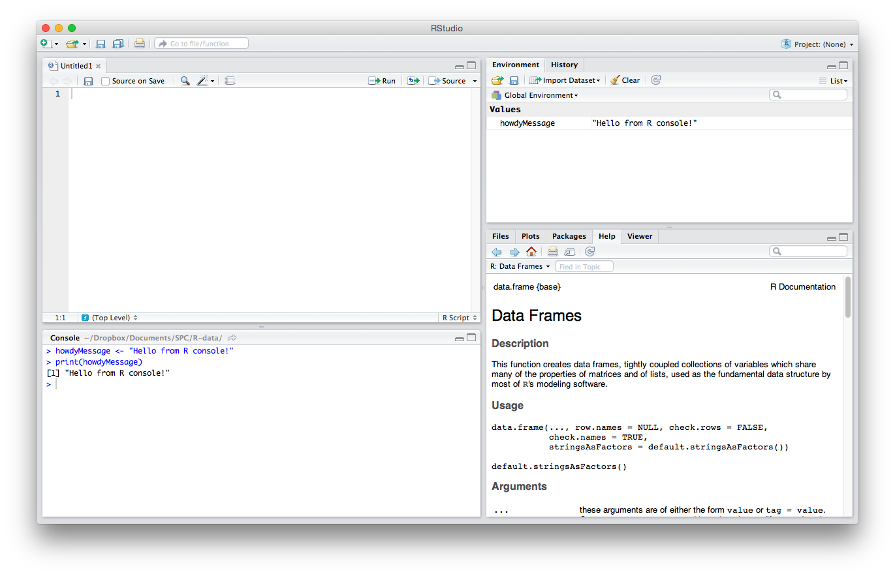
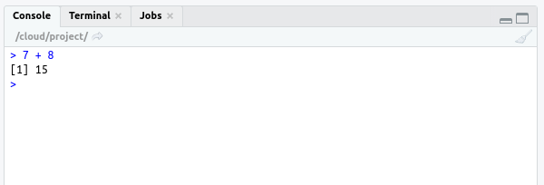
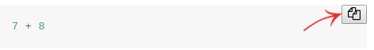

```{r}
#| echo: false
source("_common.R")
```

\newpage

# Introduction

<!-- Prepare the first session

* Making RStudio account (install RStudio)
* Watch instruction videos for the session
* Work on the exercises
* If your use a local installation of RStudio and not Rstudio.cloud, it might be most convenient to use your own laptop during the practical sessions.
* Do not forget get to bring headphones?
-->


## Why learning _R_?

_R_  is a computer language designed by statisticians. I think it is fair to say that _R_ became in the recent year the "lingua franca" of data science and statistics. _R_ is an open source software and an extremely powerful tool for any kind of task in scientific computing. It is not only great for data transformation, data visualization and statistical analyses. It is has also the capacity to deal with big data or to do text mining and analysis of internet pages and to do machine learning and more.

_R_ has a very large and active open source user community. For that reason, it very easy to find online help if you have questions and if you need support for analysis problems that are difficult to handle (see @sec-findinghelp). Moreover, the language is constantly improving and hundreds of data scientists have develop extensions for _R_ (so-call *packages*) that implement various classical and novel statistical methods. You can do indeed any statistical analysis you can think of in _R_.

Please keep in mind: _R_ 's learning curve is steep partially due to its syntax and the rules of the programming language that you have to learn. _R_  reads less like English, and in general is more difficult for beginners to wrap their heads around. However, once you got familiar with _R_, it makes processing of data much easier as compared to tools such as *Excel* or *SPSS*.


## What do I learn in this course?

This course is merely a first introduction to _R_. It does not required any pre-knowledge in computer programming (For those of you who have already experiences with any kind of programming language, I guess it's is not a big deal to learn _R_).

This course will teach you the minimum about computer programming that you need to practice data science and get started with doing data analyses in _R_. We will use _R_ (and RStudio) predominantly as an interactive environment for data science that enables you to read, process and analyse data. If you want to develop your _R_ skills beyond is basic usage and if you want to use _R_ as a programming language to develop your own programs and/or packages, I point you to the advanced literature in the @sec-readings.


## What is RStudio?

As said before, _R_ is just a programming language, which executes commands and produces certain output. To interact with the programming language, we need a program that enables us to enter the commands and edit scripts that should be executed by  _R_ scripts. Moreover, we need a program that display the output of our _R_ programs, that is, to show results of our calculation or display graphics that we made with _R_.

**RStudio** is a program which does this (and more) for us. RStudio is a so-called integrated development environment (_IDE_) for _R_ programming. It is the interface that we use in this course to intact with the programming environment _R_ and it looks like this

```{r out.width="650px", fig.cap="RStudio Window", echo=FALSE}
#| label: fig-rstudio

```

### The RStudio Interface

If you open RStudio, you get a window which look like Figure @fig-rstudio.  RStudio has

* a console that you will use to enter commands and try out code (appearing as the **bottom left** window)
* there is a script editor on the **top left**
* a window with the ''Environment'' tab (**top right** window), which shows functions and objects you have created and which are currently in memory, and
* a window that shows plots, files packages, and help documentation (**bottom right**)

You will learn more how to use this program during this course.

::: {.geek}
If you have already programming experiences and a strong preference for a certain coding editor or IDE, you may use your preferred coding environment and integrate the _R_ command line software to run your scripts.

Using coding editors is never as comfortable as working with the specialized tool *RStudio*. However, some nerds want the puristic command line experiences.
:::


## Code examples

The manual comprises many code examples. A code example always looks like this:

```{r}
#| eval: false
7 + 8
```

The output that _R_ returns in the console after processing the command is indicated in the manual with `##` and looks like this:

```{r echo=FALSE}
7 + 8
```

It is suggest to execute the code examples in your own _R_-console and see what the results are. To do so, copy & paste the code in the console and press enter. _R_  executes the code and give you feedback. In RStudio it like this:


```{r out.width="450px", fig.align = 'center', echo=FALSE}

```

*Hint*: You can copy the code examples from the online manual by the clicking on the 'copy-button', which appears if you move with the mouse course to right-top corner of the code example field.

```{r out.width = "450px", fig.align = 'center', echo=FALSE}

```


### Text boxes

There are different types of text boxes:

::: {.important}
**Important** information.
:::

::: {.geek}
Additional information for **advanced learners**. This is only for nerds and not relevant for most students. If you want, can simply ignored it.
:::

::: {.myexercise}
This icon indicates an **exercise**. Solutions to some exercise problems are provided and help to check whether you understood the learning material. In the online version the solutions are hidden and will be display only on request.
:::

`r hide()`
```{r, eval = FALSE}
# This is a solution to an exercise problem.
```
`r unhide()`


## Trial-and-error learning


Trial-and-error is very essential for learning to program. I therefore suggest: *Play around with the code examples and see happens if you change them.*

You will face many error and warning messages as a consequence. But that fine! Learning to understand error messages is, in my view, the key to learn to program. Thus, read the error messages always carefully (instead of freaking out) and try to figure out what the origin of this underlying error is. This is not always easy and finding a bug in a program code (called *debugging*) is often very time-consuming. However, it is an important (if not the most important) skill for any data scientist.

Don't worry, if you have the feeling at the beginning that you spend most of your time with debugging---you have to know, is quite normal.
