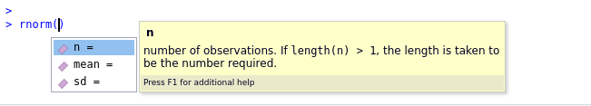

```{r}
#| echo: false
source("_common.R")
```

# Basics of Programming in R

Learning to work with *R* requires a little knowledge about basic
concepts of computer programming. This is maybe a bit technical at the
beginning. However, having an insight in this basics makes it later much
easy to deal with real data analysis in *R* later.

Thus, the section covers the basics of the *R* programming language. If
you are already familiar with any another programming language, I guess
these things are not new for you.

## Comments in Program Code

Before we have a look at the first *R* code examples, you should know
that *R* ignores everything that follows a hashtag `#`. That is, text
after a `#` will not be executed. Hashtags are used to add comments to
*R*-code. The comments help to document and explains the code and make
it thus more readable for humans. Comments in *R* code are printed in
italic font and a different color by *RStudio* (and in the manual). See
this example:

```{r eval=FALSE}
# Example of code with comments
x = a / b       # dividing a by b and storing the result in x
```

That is, if you try out the code examples, you can simple ignore the
comment.

::: {.important}
If you later develop your own analyses scripts in _R_, it is __strongly__ suggested to make use of comments. Only well documented code is readable code. Only if you comment your code, you will be able to remember after a few days why you did what and how your codes works.
:::

## Variables and Objects

Everything that is stored in *R* is called an **object**. The most basic
example for an object is an numerical **variable**. For instance,

```{r}
a <- 9
b <- 2724.54
third_variable <- 71
```

In this example, the numerical `9`, `2724.54` and `71` are stored in the
variables with the names `a`, `b` and `third_variable`. If you want to
print out the content of a certain object or variable, you can use the
`print()`-command together with the variable.

```{r}
print(b)
```

$\ldots$ or even simpler, just enter the variable name in the console

```{r}
third_variable
```

::: {.simple}
This [video](https://vimeo.com/220493412) also explains objects in _R_.
:::

### Variable Environment

All variables are sorted in the data workspace or environment. In
RStudio, you can find the current content of the workspace with all
variables the right top panel called "environment".

Alternatively, the command `ls()` lists all objects variables in the R
console.

```{r}
ls()
```

### Equal Sign Assignments (`=`) {#sec-assignment}

As you have see above, to assign a value to an object (i.e., variable)
with the left arrow `<-`. In RStudio, the shortcut `alt & -` is very
handy for quickly typing this sign. Check it out.

Instead of typing an left arrow `<-` you can use the equal sign `=`.
This two comments have the identical effect:

```{r}
x <- 13
x = 13
```

Many data scientists find the equal-sign syntax easier to type and more
natural to read. If you also prefer using `=` instead of `<-`, just do
it. It's not a problem.

You just need to know, that the coding style guidelines in the *R*
community suggest to use the `<-` syntax. (see e.g.
[here](https://www.r-bloggers.com/why-do-we-use-arrow-as-an-assignment-operator/)
for reasons). Most examples and documentations that you find online use
therefore the arrow as the assignment operator.

To avoid any confusion, the current manual uses the `<-` operator .

### Left and Right Hand Side Assignments

In *R*, there are two different ways to assign a value to a variable;
you can either assign from left to right or from right to left in R.
That is, instead of using `<-` or `=`to assign a value to a variable
(left-hand-side assignment), you can also work with so-called the
right-hand-side assignments (`->`). These comments illustrate the
principle:

```{r eval=FALSE}
x <- 13       # left-hand-side assignment
13 -> x       # right-hand-side assignment

a <- b        # a receives the value of b
a -> b        # b receives the value of a
```

Left-hand-side assignments are most common among users, because the are
similar of what we are used to in mathematical equations. You will see
later in the course (when working with **pipes**), why right-hand-side
assignment can be very elegant and efficient for data science.

::: {.myexercise}
What happens in the command below? What are the changes variable environment?

``
E = U = R = 2
``
:::

`r hide()`

```{r, eval = FALSE}
# 1. The value 2 is assigned to R.
# 2. U is assigned to R
# 3. E is assigned to U
# That is, you have three variables with the value 2
```

`r unhide()`

## Basic operations

You use *R* as a calculator and perform basic operations on numbers and
variables numbers. Just enter the following examples the console and
check the results:

```{r eval=FALSE}
a <- 8

12 + 6
a * 2
210 / 3
(a - 3) / 4
4**3     # 4 to the power of 5
```

Of course, the result of a calculations can be stored in new variables,
for instance:

```{r}
x <- a * 7
x
```

Look at the following example, which increases the value of the variable
`x` by 1. To do so, it stores the result of the operation `x + 1` again
in `x`:

```{r}
x <- 9
x <- x + 1
x
```

::: {.myexercise}
See the code example below. If `r` represents the radius of a circle, what is `x` ?
:::

```{r}
r = 19
pi*(r**2) -> x
```

`r hide()`

```{r, eval = FALSE}
# The area, which is pi times radius squared.
```

`r unhide()`

## Non-numerical data types

### Character

Besides numeric values as in the example above, *R* can store text
(called `character`) in variables.

```{r}
txt <- "Erasmus"
```

You can see the new variable in the current workspace (see
''environment''-panel).

Certain operations can be only performed with certain data types. For
instance, it does not make sense to substract or add to text string,
right? See what happens:

```{r eval=TRUE}
a <- "Hello"
b <- "World"
```

```{r eval=FALSE}
a + b
```

```
## Error in a + b : non-numeric argument to binary operator
```

If you want to concatenate two strings you have to use the function
`paste`:

```{r eval=TRUE}
paste(a, b)
```

::: {.important}
_R_ can sometimes convert one atomic data type into another data type. Function that convert data types start in _R_ with "`as.`". For instance,

* `as.character()` converts as numbers into a string
* `as.numeric()` converts a character into number. see @sec-comparediffdata
:::

### Logicals {#sec-logicals}

Another often reoccurring data type is call *logical* (in other
programming languages it's other call *boolean*). A logical can be only
`TRUE` or `FALSE` (typed in capitals without quotation marks); it is in
other words a binary variable.

Logicals are very important, because are returned by *R* if you make a
comparison of the numbers (see @sec-comparing.)

#### Negation: `!` {.unnumbered}

In *R*, `!` is used for the negation of logicals and reads like "*is
not*". It converts, in other words, a `TRUE` to `FALSE` and `FALSE` to
`TRUE`:

```{r eval=TRUE}
!TRUE    #  reads like "is not true"
!FALSE   #  reads like "is not false"
```

### Combining different data types {#sec-comparediffdata}

Please note, that you can preform the same operation that not combing a
numerical and text variable is, of course, not possible. Try what
happens if you type:

```{r eval=FALSE}
a <- 4
b <- "12"
a * b
```

The third line results in an error, because `a` is a number and `b` is a
text object. Combining this different data types is not possible,
because *R* does not know what to do.

::: {.myexercise}
Why does this work?

`a * as.numeric(b)`
:::

`r hide()`

```{r, eval = FALSE}
# b is a string, but it will be converted to a number (by the function
# as.numeric). Multiplying two number is, of course, a valid operation.
```

`r unhide()`

Write the R code for the following equation:

## Comparing values {#sec-comparing}

You can compare numerical variables using comparators. For example,

```{r}
a <- 27
b <- 30
a > b
```

You see that this expression is incorrect, because $`r a`<`r b`$ .

Further comparisons are:

```{r eval=FALSE}
a < b
a == b   # Are a and b are equal?
a != b   # Is a unequal to b?
```

Note that *R* needs two equal signs `==` for an ''is-equal-comparison''.
One equal sign is interpreted by *R* as an assignment, similar to `<-`
(see @sec-assignment).

## Functions {#functions}

As other programming languages, *R* has **functions** to perform a
specific tasks in a program, for instance, to process or manipulate
data. A function "returns" a results of the command or the processing.
For instance, the function `ls()` lists current variables in the
workspace.

::: {.important}
To execute a function, you always have call the function name __followed by parentheses__.

Forgetting the parentheses results in strange behaviour. (That is, _R_ displays the definition of the function, if you just entering the function name.)
:::

### Arguments

Often, functions take one or more arguments. The arguments are for
instance data to be processed or certain information that are required
to execute the task. For instance,

```{r eval=TRUE}
log(64)
```

returns the logarithm natural of 13, $\log_e(13)$, and prints it out in
the RStudio console. You can also save the result directly in another
variable, because you want to do some further processing later with it
or you can combine functions. For example:

```{r eval=FALSE}
x <- log(64)
```

::: {.simple}
[See also this video explaining functions in _R_.](https://vimeo.com/220490105)
:::

You can also feed the result of a function directly into another
function. For example:

```{r eval=FALSE}
sqrt(log(64))
```

`sqrt()` is the command for the square root. This nesting of functions
and expressions makes it the implement mathematical expression in *R*
very straightforward. For instance, is

::: {.myexercise}
Write the R code for the following equation:

$$x = \sqrt{15^\frac{\log_e(12)}{1+ \sin(4.5)}}$$

Hint: `sin()` is function for sinus. The variable `pi` is always predefine in R, even if you can not see it in the environment panel.
:::

`r hide()`

```{r, eval = FALSE}
x <- sqrt(15**(log(12) / (1 + sin(4.5))))
# Sorry, I know the example is not a very meaningful.
```

`r unhide()`

Importantly: Functions expect a specific data type as argument. If the
type of the argument is not correct, you will receive an error. For
instance, the function `sin()` (the sinus) expects a number not a text
string. Look what happens:

```{r eval=FALSE}
x = "1987"
sin(x)
```

**Required and optional arguments**

Some arguments of functions are required (that is, you have to specify
this them) and others are optional. Optional arguments will often use a
default value (normally specified in the help documentation), if you do
not enter any value.

For instance, if you just call `log(64)` you get the natural logarithm
$\log_e(64)$. If you want to have the logarithm to a different base,
e.g. $\log_{2}$ or $\log_{10}$, you have to specify the optional
argument `base` of the `log` function:

```{r eval=TRUE}
log(64, base=2)
log(64, base=10)

```

### Built-in help for functions {#sec-builtinhelp}

*R* provides hundreds functions. As you will see late in @sec-packages, you can install additional packages for specific tasks,
which provide basically collections of extra functions. That is, the
amount of functions that you can use in *R* is almost endless.

But how do you know what a specific functions is doing and which
arguments you can or have to define to use it correctly. Fortunately,
*R* has a **built-in help system**. You can look up all the arguments
that a function takes by using the help documentation by using the
format "`?function`".

As an example, let’s look at the help documentation for the function
`rnorm()` which randomly generates a set of numbers with a normal
distribution.

### Example {#sec-examplernorm}

Display the documentation of the function `rnorm` by typing

```{r eval=FALSE}
?rnom
```

The help documentation should appear in the bottom right panel. In the
usage section of the documentation, we see that `rnorm()` takes the
following form:

-   `rnorm(n, mean = 0, sd = 1)`

In the arguments section, there are explanations for each of the
arguments. `n` is the number of random numbers we want to create, `mean`
is the mean of the data points we will create and `sd` is the standard
deviation of the set. In the details section it notes that if no values
are entered for `mean` and `sd` it will use a default of 0 and 1 for
these values. Because there is no default value for `n` it must be
specified otherwise the code won’t run.

Let’s try an example and just change the required argument `n` to ask
*R* to produce 5 random numbers.

```{r eval=TRUE}
rnorm(n = 5)
```

The random numbers have a mean of 0 and an SD of 1. Of course, since
this are random numbers, you have probably got different numbers. Run
the function again and you will see that you get each time different
''random'' numbers.

Now we can change the additional arguments to produce a different set of
numbers.

```{r eval=TRUE}
rnorm(n = 5, mean = 100, sd = 15)
```

This time *R* has still produced 5 random numbers, but now this set of
numbers has a mean of 100 and a standard deviation of 15 as specified
(this is the distribution of the scores in many IQ tests). Always
remember to use the help documentation to help you understand what
arguments a function requires.

### Argument names

In the above examples, we have written out the argument names in our
code (e.g., `n`, `mean`, `sd`), however, this is not strictly necessary.
The following two lines of code would both produce the same result
(although each time you run `rnorm()` it will produce a slightly
different set of numbers, because it’s random, but they would still have
the same mean and SD):

```{r eval=FALSE}
rnorm(n = 7, mean = 10, sd = 2)
rnorm(7, 10, 2)
```

Importantly, if you do not write out the argument names, R will use the
default order of arguments, that is for `rnorm` it will assume that the
first number you enter is `n`. the second number is mean and the third
number is `sd`.

If you write out the argument names then you can write the arguments in
whatever order you like:

```{r eval=FALSE}
rnorm(sd = 2, n = 7, mean = 10)
```

When you are first learning R, you may find it useful to write out the
argument names as it can help you remember and understand what each part
of the function is doing. However, as your skills progress you may find
it quicker to omit the argument names and you will also see examples of
code online that do not use argument names so it is important to be able
to understand which argument each bit of code is referring to (or look
up the help documentation to check).

In this manual, I will mostly write out the argument names the first
time , however, in subsequent uses they may be omitted.

::: {.important}
The assign a value to an named argument of the function, you have to use the equal sign `=` and not `<-`.
:::

### Tab auto-complete

One very useful feature of R Studio is the tab auto-complete for
functions (see Figure @fig-autocomplete). If you write the name of
the function and then press the tab key, R Studio will show you the
arguments that function takes along with a brief description. If you
press enter on the argument name it will fill in the name for you, just
like auto-complete on your phone. This is incredibly useful when you are
first learning R and you should remember to use this feature frequently.

```{r out.width="450px", fig.cap="The tab auto-complete of RStudio.", echo=FALSE}
#| label: fig-autocomplete

```

::: {.myexercise}
Get the documentation of the optional argument `sd` via the autocomplete function in RStudio. Compare it with the `?`-documentation.
:::

### Important Base R functions

When you install *R* you will have access to a range of functions
including options for data wrangling and statistical analysis. These
functions that are included in the default installation are typically
referred to as Base *R* . There is a very useful overview that shows the
most important Base *R* functions.

An overview of this functions is online available as pdf and call the
"[Base R cheat sheet](#sec-cheatsheets)".

Don't worry, you don't have to know this functions. You just have to
know **how to figure out** which function is needed to accomplish you
task and where you find to detailed information how to use this function
(see @sec-findinghelp).

### User-defined functions

The real power of a programming language is that you can develop your
own functions that accomplish reoccurring tasks or that this way
facilitate or structures your analysis.

Moreover, there are many collections of additional functions for
specific tasks available online. They extend your *R* functionality and
have been programmed by other data analysts or statisticians. This
extensions are called in *R* "**packages**".

Later in the course we will a package called
[Tidyverse](https://www.tidyverse.org/), which extends the *R* by many
convenient functions for data handling. But for know, let's keep it
simple and just focus for now on the usages of the basic built-in
functions in *R*.

::: {.geek}
If you want to develop your own functions (or even packages), please have a look, for instance, at the [online tutorial](https://r4ds.had.co.nz/functions.html) of Grolemund and Wickham or see the [suggested reading](#readings).
:::

