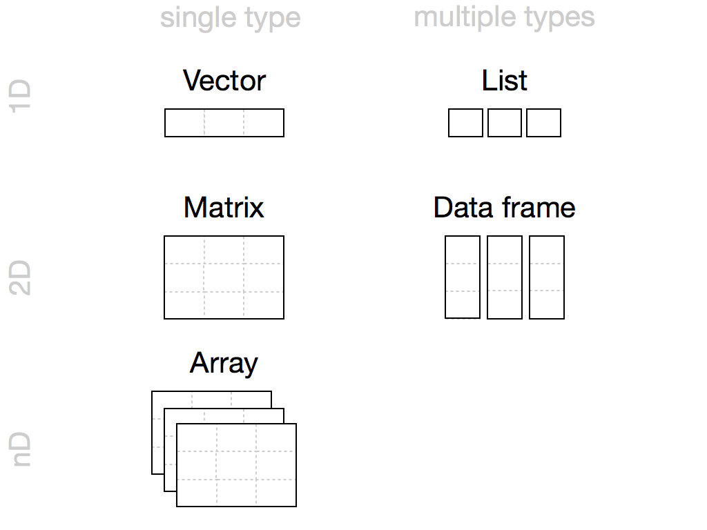

```{r}
#| echo: false
source("_common.R")
```

# Data Frames {#sec-dataframes}

So far, we have worked in this course with very basic data structures. In psychology we have often a specific type of data so-called tabular data. Tabular data are data that can be stored in a table with different variables arranged in columns. The rows of the table comprise different cases. You do know this kind of data from spreadsheet or statistics software like *MS Excel* or *SPSS*. For example:

```{r, echo=FALSE, eval=TRUE}
df <- data.frame(Subject_id = c(1,2,3, 4),
                 Gender = c("female", "female", "male", "male" ),
                 IQ=c(102, 121, 112, 103),
                 International_student = c(FALSE, FALSE, TRUE, FALSE))
kable(df,  booktabs = TRUE, caption = "A tabular dataset.")
```

In _R_, **tabular data are stored in data frames**. Data frames are the two-dimensional version of a list. They are far and away the most useful storage structure for data analysis, and they provide an ideal way to store that above.

Data frames group vectors together into a two-dimensional table. Each vector becomes a column in the table. As a result, each column of a data frame can contain a different type of data; but within a column, every cell must be the same type of data.


```{r, out.width="650px", fig.cap="Data frames", echo=FALSE}
knitr::include_graphics('images/data_frame_types.png')
```


Data frames store data as a sequence of columns. Each column can be a different data type. Every column in a data frame must be the same length.

Creating a data frame by hand takes a lot of typing, but you can do it (if you like) with the `data.frame` function. Give `data.frame` any number of vectors, each separated with a comma. Each vector should be set equal to a name that describes the vector. `data.frame` will turn each vector into a column of the new data frame:


```{r}
df <- data.frame(Subject_id = c(1,2,3, 4),
                 Gender = c("female", "female", "male", "male" ),
                 IQ=c(102, 121, 112, 103),
                 International_student = c(FALSE, FALSE, TRUE, FALSE))
```

You’ll need to make sure that each vector is the same length. The resulting data frame looks like this:

```{r eval=TRUE}
print(df)
```

::: {.important}
Remember: **Use the `=` assignment inside functions**

Since you `data.frame` is a function and `Subject_id`, `Gender`, `IQ` and  `International_student` are arguments of this function, you have to use the equal sign `=` to map the vectors to variable names and not the left hand side assignment `<-`.
:::


### Variable overview  {-}

To function `str()` gives you a side-wise overview of the variables in a data frame. This show the variable names, the data types and the first few data points:

```{r eval=TRUE}
str(df)
```

### Descriptive summary {-}

A descriptive summary of all variables a data frame is very handy and important to check your data quality and to exclude potential technical issue in your dataset.  It's very simply to do by:

```{r eval=TRUE}
summary(df)
```

**You should always do quality checks like this, if you read in tabular data.**

::: {.myexercise}
**Quality check**

Below you see summarizing information about dataset call `demo_data`. Without knowing the data in detail, what is strange in this dataset?
:::

```{r echo = FALSE, eval=TRUE}
demo_data = data.frame(variable_a = rnorm(200) * 100 + 77,
                variable_b = rnorm(200),
                variable_c = 10 )
demo_data$variable_b[70:200] = NA
```
```{r eval=TRUE}
nrow(demo_data)
summary(demo_data)
```

`r hide()`
The summary of this dataset shows that

1. you have many missing values in `variable_b` (131 out of 200 rows).
2. `variable_b` comprises always of the same value 10 and has thus no variance. This might be a problem for you later statistical analyses.


`r unhide()`


## Subsetting

### Selecting columns by name {#sec-selectbyname}

You can access a specific column/variable of the data frame with `$` [operator](#sec-listsdollar) as you know it from [lists](#sec-lists). For example:

```{r eval=TRUE}
df$IQ
```

As you see above, if you access a variable of a data frame with the `$` operator, you get an [atomic vector](#sec-vectors). This means that you can use subsetting of vectors as described in @sec-subsetting.

```{r eval=TRUE}
g <- df$Gender   # g is a vector with the genders
g[2]             # print the gender at the second positions
```

But this can be done also in one expression.

```{r eval=TRUE}
df$Gender[2]   # get the Gender in the second row position
```


::: {.myexercise}
* Calculate the median of the IQs of the subjects in the data frame.
* Make a vector of logicals that is `TRUE` for all students that have an IQ larger than the mean IQ (and `FALSE` otherwise). Include this vector as new variable  `is_clever` to our data frame.
:::

`r hide()`
```{r eval=TRUE}
m_iq = mean(df$IQ)
m_iq
df$is_clever <- df$IQ > m_iq
df
```
`r unhide()`


### Selecting by row and column indices

Cells in an data frame can be also access via row and column indices and the `[]` operator. The syntax looks like this: `[row_index, column_index]`.

```{r eval=FALSE}
# Check what you get
df[1, 3]             # returns from the 1st row the column 3
df[2:4, 3]           # returns from row 2-4 the column 3
df[c(1, 4), c(2,3)]  # returns from row 1 and 4 of the columns 2 and 3
```
If you omit one of the indices _R_ takes all rows or columns of the omitted index.

```{r eval=FALSE}
df[, 2]    # all rows of column 2
df[4, ]    # all columns of row 4
```

Consequently, `df[,]` or `df[]` should return the entire data frame...and this exactly what _R_ is doing.


::: {.myexercise}
* Access all columns from the 1st and 3rd row of `df`.
* Do this also in an reversed order of the columns. That is, the first column should be `International_student`.
:::

`r hide()`
```{r, eval = TRUE}
df[c(1, 3), ]
df[c(1, 3), 4:1]
```
`r unhide()`

<!-- HACK median split for assignment -->

### Subsetting with logicals  {#sec-subsettinglogicalsdataframe}

@sec-subsettinglogicals demonstrated that you can select subsets with logicals. This subsetting with logical vectors is very useful for data frames and very often used. For example, if you want to have the data of the females only:

```{r eval=TRUE}
selected_rows <- df$Gender == "female"   # logical vector with TRUE for females
df[selected_rows, ]

```
Alternatively you can write it in one line:
```{r eval=FALSE}
df[df$Gender == "female", ]
```
::: {.myexercise}
Make a data frame with the clever people only.
:::
`r hide()`
```{r, eval = TRUE}
clever <- df[df$is_clever, ]  # this clever is already a logical vector
clever
```
`r unhide()`


## Lists and data frames

Since lists and data frame can store multiple atomic vectors and they can actually both store tabular-like data. You can therefore convert between this two types using an `as.`-converter function. For instance, the list `lst` that we made in @sec-lists can be converter to a data frame.

```{r eval=TRUE}
lst <- list(subjects=c("John", "Maria", "Linda"),
            body_len=c(1.92, 1.71, 1.63))

df2 <- as.data.frame(lst)
df2
```

Note, converting a list to a data frame makes only sense, if the data in the list are indeed tabular, that is, if all objects in the list are atomic vectors of the same length.


Finally, a data frame can be converted into a list using `as.list()`. See what you get, if you convert the above data frame `df`:

```{r, eval = TRUE}
as.list(df)
```


## Summary: Data structures in _R_

You can store data in _R_  with five different objects, which let you store different types of values in different types of relationships. The most common data structures in the analysis of psychological data are **vectors**, **lists** and **data frames**. For the sake of completeness, you should know that **matrices** and **n-dimentinal arrays** also exists in _R_---they are however not relevant for this course.


```{r, out.width="650px", fig.cap="Overview of data structures in R", echo=FALSE}

```

Importantly,  data frames can store data of different types (e.g. number, characters, text, factors, logical). Each column is conceptually a atomic vector and can thus only store data of one type. Data frames store the most common forms of data used in statistics, which are tabular data.
