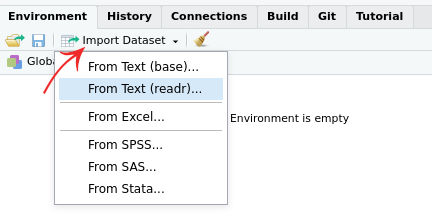

```{r}
#| echo: false
source("_common.R")
```

# Importing Data

A crucial function of a statistical software is of course the ability to read data from files. There are many different types of files that you might work with when doing data analysis. These different file types are usually distinguished by the three letter extension following a period at the end of the file name. Here are some examples of functions (and packages!) that you can use to import data from different file types:

| Extension   | File Type              | Reading                | Writing |
|-------------|------------------------|------------------------|---------|
| .Rdata, .Rds   | _R_'s own data format     | `load()` or `readRDS()`         | `save()` or `saveRDS()` |
| .csv        | Comma-separated values | `readr::read_csv()`    | `readr::write_csv()` |
| .tsv, .txt  | Tab-separated values   | `readr::read_tsv()`    | `readr::write_tsv()` |
| .xls, .xlsx | Excel workbook         | `readxl::read_excel()` | -- |
| .sav        | SPSS data         | `haven::read_sav()` | `haven::write_sav()` |
| .dta        | Stata data         | `haven::read_dta()` | `haven::write_dta()` |


As you see, different packages that are dealing with data import. You have already installed the packages `readxl` and `readr` in the previous exercise.


**Example data**: You find some example data files in the `r data_folder` of this course.


## Import via RStudio interface

_R_ offers several ways to import data from a file. One way is RStudio's import functions (see this week's instruction video).


**.Rdata:** _R_ 's own data files (.Rdata) can be very easily imported just by clicking on the file in the file browser.

::: {.myexercise}
You find a file `babynames.Rdata` among the example data. It contains the frequencies of names given to babies in the US since 1880.

Load the dataset (via double click). How many rows does this file have?
:::

`r hide()`
Almost two million rows: `1924664`
`r unhide()`


#### Other file types {-}
To import data from other (non-_R_) file types, you can use the import panel of RStudio.

```{r, out.width="350px", echo=FALSE}

```

## Import via Console or Script

### .Rdata {-}

To load an _R_ data file via a script or the console, you called `load()` and the file path as argument. A file path consist of the subdirectory (relative to your current directory) and the filename separated by a `/` (backslash). For instance, if the data file is `babynames.Rdata` located in the subfolder `data`, this command should load the dataset:

```{r eval=FALSE}
load("data/babynames.Rdata")
```

**Hint:** You can use the autocompletion function of RStudio and type only `load("`, followed `TAB`.


::: {.important}
Since file paths are always relative to the **current working directory**, you need to check in which directory you are currently in (or in which folder the current script is).

The console displays the current working directory on top of the console panel. Also the command `getwd()` gives you this information. The autocompletion function is also handy here.
:::


### csv- and xlsx-files and other files {-}

When you read in CSV files, it is best practice to use the `readr::read_csv()` function. Note that you would normally want to store the result of the `read_csv()` function to an object, as so:

```{r eval=FALSE}
library(readr) # load the package (just needed the first time)
csv_data <- read_csv("data/exam_anxiety.csv")
```

The function `read_excel()` from the package `readxl` is handy to read in  Excel spreadsheet data.

A summary of data import function can be found in this [data import cheat sheet](#sec-cheatsheets).
